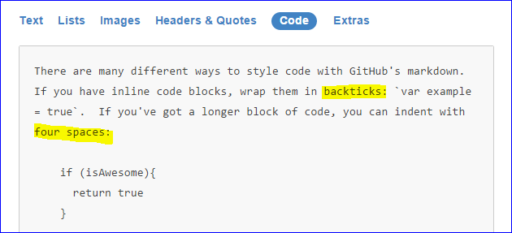

## GitHub Kılavuzu

GitHub kullanmak için üç önemli sebep:
* Yazdığınız ve kullandığınız kod merkezde dursun, her yerden erişilebilsin
* Otomatik sürüm kontrolü ve koordineli takım çalışması 
* Programcılar için özgeçmişin önemli bir parçası

Git'in akış ve dallanma mantığını anlamak için iyi bir başlangıç [burada](https://guides.github.com/introduction/flow/)

### GitHub Desktop

Mac ve Windows için yazılmış bu program ile Git kullanmak çok kolaylaştı

Öncelikle [GitHub hesabı açmak](https://github.com/join) ve [Desktop programını kurmak](https://desktop.github.com) gerekiyor

Örnek olarak eski bir projemizi GitHub'a koyalım:
* Klasörü programın açık penceresine sürükleyin, güzel bir isim verin
* "Uncommitted Changes" üstünde tıklayın, yeni bir isim ile `Commit` düğmesine basın
* `Publish` düğmesine basarak kendi GitHub hesabınıza ekleyin

İşimiz üç adımda bitti, projemiz hem yerel diskte hem de GitHub repository'de duruyor
* Bunlardan biri değişince, `Sync` düğmesine basmak gerekiyor  **<-- Bu adım otomatik değil**

### Markdown (MD) formatı

HTML karmaşasını en sık kullanılan komutlarıyla basitleştiren 
[MD formatını](https://guides.github.com/features/mastering-markdown/#examples) on dakikada öğrenmek ister misiniz?

Markdown denemeleriniz için [bir çevirmen](http://dillinger.io/)

### Git CLI

Desktop programı öncesinde, bu adımları *Command line* içinde lokal klasör altında `git` komutu ile yapmak gerekiyordu

Yukarıda anlatılan her işleme karşı gelen `git` komutu ile kıyaslayınca sürecin ne kadar basitleştiğini görebilirsiniz:
* Klasörü programın açık penceresine sürükleyin   `git init`
* "Uncommitted Changes" üstünde tıklayın   `git add *` (tam bunu yapmıyor)
* ... yeni bir isim ile `Commit` düğmesine basın  `git commit -m "yeni bir isim"`
* `git remote add origin https://github.com/maeyler/xxx.git` (remote repo'yu tanıtmak için)
* `Publish` düğmesine basarak kendi GitHub hesabınıza ekleyin  `git push origin master`
* `Sync` düğmesine basmek gerekiyor   `git push origin master; git pull`

Git için [kısa bir özet](http://try.github.io) ve [kapsamlı bir kitap](https://git-scm.com/book/en/v2) var 
ama Desktop programı normal bir kullanıcının bütün ihtiyacını karşılıyor

### Referanslar

* https://forvo.com/word/github/
* https://en.wikipedia.org/wiki/Git_(software)
* https://github.com
* https://desktop.github.com
* https://guides.github.com
* https://guides.github.com/introduction/flow
* https://guides.github.com/introduction/getting-your-project-on-github
* https://guides.github.com/features/mastering-markdown/
* https://dillinger.io
* https://try.github.io

### Teşekkürler

* Gürsu Gülcü 
* [Hakan DILEK](https://github.com/hakandilek)
* Ayla Gülcü
* [Güngör Yılmaz](https://github.com/gungor)
 
Eski öğrencilerim bu konuda bana öğretmen oldular :smile:
